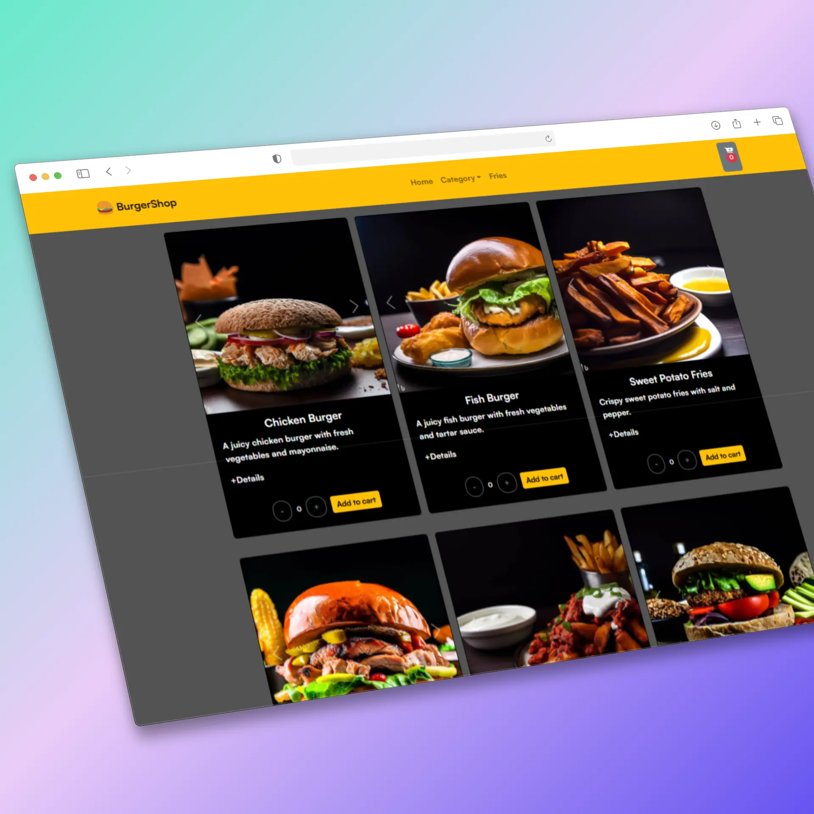

## Tabla de contenido
1. [Descripción](#descripción)
2. [Rol](#rol)
3. [Problemas](#problemas)
4. [Metas](#metas)
5. [Solución](#solución)
- [¿Cómo se hacen pedidos actualmente?](#cómo-se-hacen-pedidos-actualmente)
- [¿Qué valoran los usuarios?](#qué-valoran-los-usuarios)
- [Experiencia del usuario](#experiencia-del-usuario)
6. [Pruebas de usuario](#pruebas-de-usuario)
7. [Desafíos y aprendizajes](#desafíos-y-aprendizajes)
8. [Reflexiones finales](#reflexiones-finales)

---

## 🧭 Descripción
**BurgerShop** es un ecommerce web diseñado como práctica de estudio, enfocado en la venta de hamburguesas artesanales. Los usuarios pueden navegar un catálogo de productos, añadir sus favoritos al carrito y simular un proceso de compra ágil y moderno.  

Construido con **React**, **Bootstrap**,**Firebase** y **Node.js**, el proyecto busca replicar la experiencia de un ecommerce real aplicando buenas prácticas de desarrollo frontend y backend.

---

## 👨‍💻 Rol
**Desarrollador Fullstack** y **Diseñador UI/UX**

---

## ❓ Problemas
Al analizar comercios locales de comida rápida, se identificaron problemas comunes:
1. Menús poco claros o difíciles de navegar.
2. Procesos de pedido confusos que hacen que el usuario abandone antes de completar la compra.

---

## 🎯 Metas
1. Crear un ecommerce funcional y atractivo, simulando la experiencia de un restaurante digital.
2. Permitir personalización de pedidos de manera intuitiva.
3. Diseñar una interfaz clara, rápida y optimizada para móviles.

---

## ✨ Solución

### ¿Cómo se hacen pedidos actualmente?
Los usuarios suelen:
- Pedir por teléfono o aplicaciones de terceros (con comisiones altas para el comercio).
- Consultar menús en PDF o imágenes poco interactivas.

### ¿Qué valoran los usuarios?
Durante pruebas informales se destacó:
1. **Claridad en el menú.**
2. **Proceso de compra rápido y sin pasos innecesarios.**
3. **Opciones de personalización fáciles de aplicar.**

### Experiencia del usuario
1. **Inicio:** El usuario ve un catálogo con imágenes y precios de las hamburguesas.
2. **Carrito de compras:** Muestra el detalle de los productos seleccionados y el precio total.
3. **Checkout simulado:** Flujo de pago ficticio para completar la experiencia de compra.

---

## 🧪 Pruebas de usuario
Se probó el prototipo con 5 usuarios simulando un pedido. Resultados:
- **Navegación rápida:** El catálogo fue intuitivo y fácil de entender.
- **Feedback:** Se sugirió implementar filtros para combos y agregar o quitar extras (planificado como mejora futura).

---

## ⚙️ Desafíos y aprendizajes
1. **Gestión de estado global:** Manejar el carrito y la personalización en React requirió usar Context API.
2. **Diseño responsive:** Se priorizó la experiencia en móviles, dado que la mayoría de usuarios piden comida desde el celular.
3. **Integración backend simulada:** Se desarrolló un servidor en Node.js para manejar productos y pedidos en memoria.

---

## ✨ Reflexiones finales
**BurgerShop** fue un proyecto clave para aplicar conceptos de desarrollo web moderno, combinando frontend y backend en un caso de uso realista.  

Próximos pasos:
- Implementar combos y perzonalizacion de pedido para agregar extras.
- Implementar suma parcial al agregar cantida por producto.
- Agregar un panel de administración para gestionar productos.
- Integración con pasarelas de pago reales.

---
