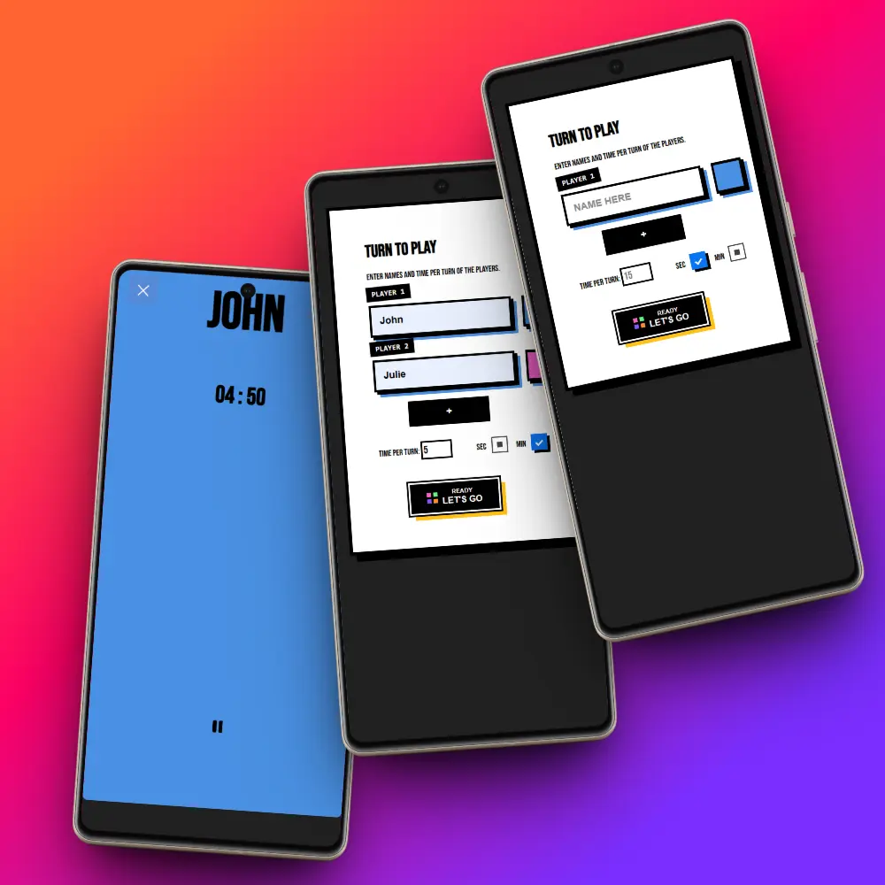

## Tabla de contenido
1. [Descripción](#descripción)
2. [Rol](#rol)
3. [Problemas](#problemas)
4. [Metas](#metas)
5. [Solución](#solución)
- [¿Cómo se gestionan los turnos actualmente?](#cómo-se-gestionan-los-turnos-actualmente)
- [¿Qué valoran los usuarios?](#qué-valoran-los-usuarios)
- [Experiencia del usuario](#experiencia-del-usuario)
6. [Pruebas de usuario](#pruebas-de-usuario)
7. [Desafíos y aprendizajes](#desafíos-y-aprendizajes)
8. [Reflexiones finales](#reflexiones-finales)

---

## 🧭 Descripción
**MyTurn** es una aplicación web ligera y rápida, pensada para facilitar la gestión de turnos entre jugadores en actividades recreativas o juegos de mesa. La app permite ingresar los nombres de los participantes, definir un tiempo específico para cada turno y ver en tiempo real quién está en turno y cuánto tiempo ha transcurrido.

Construida con **HTML**, **CSS**, **JavaScript**, la app ofrece una experiencia simple pero efectiva para escenarios donde el control del tiempo por jugador es esencial.

---

## 👨‍💻 Role
**Desarrollo Frontend** y **Diseñador UI/UX**

---

## ❓ Problemas
En muchos juegos o dinámicas de grupo, es común perder el control del tiempo por jugador o olvidar el orden de los turnos. Algunos de los problemas observados:
1. El seguimiento manual es propenso a errores.
2. No hay visualización clara de quién tiene el turno actual.
3. Las discusiones por tiempos mal medidos pueden afectar la experiencia del juego.

---

## 🎯 Metas
1. Automatizar la rotación de turnos entre jugadores.
2. Proveer una visualización clara del jugador activo y del tiempo restante.
3. Crear una interfaz accesible, rápida y sin distracciones.

---

## ✨ Solución

### ¿Cómo se gestionan los turnos actualmente?
Entrevistamos a jugadores casuales y encontramos:
- La mayoría usan cronómetros separados o papel.
- Algunos intentan usar apps genéricas, pero ninguna está adaptada a este caso de uso.

### ¿Qué valoran los usuarios?
Durante pruebas informales, los participantes priorizaron:
1. **Simplicidad y velocidad.**
2. **Indicador visual claro del turno activo.**
3. **Fácil reinicio y personalización rápida.**

### Experiencia del usuario
1. **Inicio:** El usuario agrega los nombres de los jugadores y el tiempo por turno.
2. **Turno activo:** Se inicia un temporizador que indica quién está jugando y cuánto tiempo ha pasado.
3. **Rotación automática:** Al finalizar un turno, el siguiente jugador es destacado automáticamente.
4. **Control manual:** Se puede pausar, reiniciar el turno en cualquier momento.

---

## 🧪 Pruebas de usuario
Probamos la app en un ambiente real con 8 jugadores en una sesión de juegos. Resultados:
- **Claridad visual:** Todos los usuarios destacaron lo útil del diseño minimalista.
- **Fácil configuración:** Solo tomó 1 minuto dejarla lista para usarse.
- **Feedback:** Algunos sugirieron una opción de sonido al finalizar el turno (implementado en versión final).

---

## ⚙️ Desafíos y aprendizajes
1. **Control del temporizador en múltiples estados:** Hubo que manejar correctamente el ciclo de vida del temporizador al pausar, reiniciar o avanzar manualmente.
2. **Diseño responsive:** Asegurar que se vea bien tanto en móviles como en pantallas grandes fue clave para su uso en mesas de juego.

---

## ✨ Reflexiones finales
**MyTurn** demuestra que una solución pequeña puede tener un gran impacto si se enfoca en resolver un problema específico de forma directa. A futuro, se planea:
- Agregar historial de partidas.
- Soporte para configuraciones avanzadas (rondas, penalizaciones, etc.).
- Modo oscuro y accesibilidad mejorada.

---